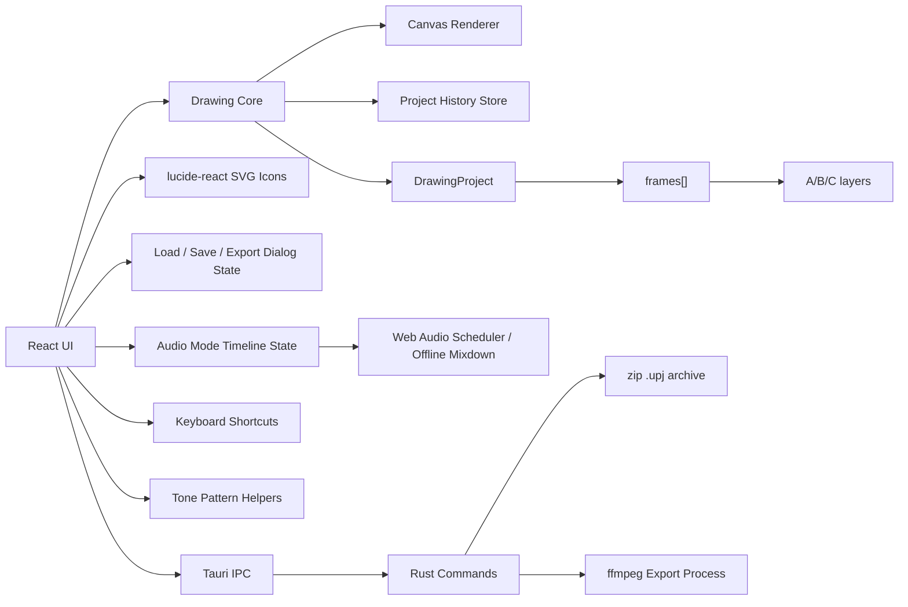

# Project Ugomemo Design

## 目的

「うごくメモ帳」風の描き味を持つピクセル描画アプリを、ページ単位のフレームアニメーション制作ツールへ拡張する。現在の主目的は、描画、ページ配列、レイヤー、オニオンスキン、再生、Audio Mode、保存/読込、音声つき書き出しの状態境界を固めること。

## スコープ

### 含める

- 固定解像度のピクセルキャンバス
- 最大999ページのフレーム配列
- 初期ページ数は1
- `currentPageIndex` による現在ページ管理
- 各ページにA/B/Cの3レイヤー
- 各レイヤーに7段階のZ深さ
- Pen / Tone / Eraser / Shape
- 白・黒・赤・青・緑・黄の固定パレット
- 1レイヤーにつき使用できる描画色は2色
- プラットフォームごとの主修飾キー押下中だけ表示するオニオンスキン
- Edit Modeでのページ編集
- Playback Modeでの再生プレビュー
- Web Audio APIによるAudio Mode再生エンジン
- 音声素材のパス管理、Rust側metadata/waveform検査、録音保存、4トラックへのクリップ配置と編集
- `audioAssets`辞書、`audioTracks`階層、non-destructive clip schema
- offline media検出、赤表示、Bundleによる`assets/`コピーと相対パス化
- クリップ単位のReverse / Trim / Split / Loop
- クリップ単位のvolume / panning / fadeIn / fadeOut
- PNG/JPEG/WebP画像書き出し、MP4/WebM/GIF/APNG動画書き出し、Sprite Sheet書き出し
- MP4/WebMへのAudio Modeミックスダウン合成、Video Only、Audio Only (WAV)
- 書き出し進捗表示とキャンセル
- Load / Save / Export中のブロッキングオーバーレイ
- グローバルステータス表示
- Undo / Redo
- Tauri IPC経由の`.upj`保存/読込パッケージ
- 固定/調整可能な`pixelsPerFrame`、横スクロール、timeline zoomによるAudio Mode編集
- 拡張可能な波形表示とclip内部編集UI

### 含めない

- ブラシの物理シミュレーション

## アーキテクチャ



大きなReact UIは段階的に分割する。現時点では `src/ui/constants.ts` に安定したUI定数、`src/ui/types.ts` に共有UI型、`src/ui/components/IconButton.tsx` に小さなpresentational component、`src/ui/keyboard/shortcuts.ts` にキーボード処理、`src/ui/tone/tonePattern.ts` にTone pattern helperを移した。Audio、Export、Timeline、Tauri副作用まわりのstate ownershipは安全性を優先して引き続き主に `App.tsx` に置く。

## プロジェクトモデル

`DrawingProject` はキャンバスサイズ、root `fps`、固定パレット、背景色、`frames`、`currentPageIndex`、`activeLayerId`、フィット表示用カメラを持つ。`fps`は`.upj`に保存され、Playback / Audio / Exportの標準同期クロックになる。各 `Frame` は `layers` を持ち、各 `Layer` は `ImageData`、2色の使用可能色、Z深さ、表示状態を保持する。

```ts
type DrawingProject = {
  width: number;
  height: number;
  fps: number;
  palette: PaletteColor[];
  backgroundColorId: string;
  frames: Frame[];
  currentPageIndex: number;
  activeLayerId: string;
  camera: Camera;
};
```

Audio Mode stateは`DrawingProject`とは別のReact stateとして保持し、保存時に`.upj`の`ProjectPayload`へ同梱する。

## 描画ツール

Canvas Workstation の描画ツールは Strategy Pattern で実装する。各ツールは共通の `DrawingTool` インターフェースを実装し、`beginStroke`、`updateStroke`、`finalizeStroke`、`drawPreview` を担当する。通常のドラッグ描画は UI が選択中の戦略を呼び出すだけにし、ツール固有の描画ロジックは strategy 側に閉じ込める。設定パネルはアクティブなツールに関連する項目だけを表示し、Shape の形状/Fill設定や Tone のモード設定は他ツール選択時に隠す。

- Pen: 標準の線描画。Stroke Weight と round / square のストローク形状を切り替える。
- Tone: Pen Mode ではパターン付きストローク、Bucket Fill Mode ではペイントバケツ型の塗りつぶし。`ctx.getImageData()` を使うカスタム Flood Fill と、トーン用の dot / line / noise の 3 基本パターンと Fine / Normal / Coarse の 3 変種を組み合わせ、合計 9 種類を UI で選択できる。
- Eraser: `ctx.globalCompositeOperation = 'destination-out'` を使い、pointerMove のたびにリアルタイムで既存ピクセルを透明化する。
- Shape: Line / Ellipse / Triangle / Rectangle を描画する。pointerDown で `getImageData()` によりキャンバススナップショットを保存し、pointerMove で背景を復元してから新しいジオメトリを描く。Line は1回のドラッグで確定し、Triangle / Ellipse / Rectangle は2段階で確定する。

Shape の Triangle は最初の pointerDown 座標を頂点、1段階目のドラッグ終端を底辺中心として扱い、2段階目のクリック位置から底辺幅を求める。これにより、ドラッグ方向へ三角形が回転する。Shape の Ellipse は最初の pointerDown 座標を中心、1段階目のドラッグ終端を長軸または単軸方向として扱い、2段階目のクリック位置から残りの軸幅を求める。Shape の Rectangle は最初の pointerDown 座標と1段階目のドラッグ終端を向きの中心線として扱い、2段階目のクリック位置から幅を求める。2段階目の待機中は Tool Settings にフィードバック表示を出し、キャンバス外クリックまたは Escape で pending preview を破棄してキャンセルする。

Shape の modifier は描画中の key state を毎回反映する。Option / Alt 押下中は Line を15度刻みにスナップする。Triangle は1段階目の回転方向を15度刻みにスナップし、形状を正三角形へ制約する。Rectangle も1段階目の回転方向を15度刻みにスナップし、形状を正方形へ制約する。Ellipse は正円へ制約する。Option / Alt を離すと通常のジオメトリに戻る。Line 以外の Shape は Fill ボタンを持つ。Shift 押下中は Fill ボタンの設定値に関わらず一時的に fill を有効にし、Shift を離すと Fill ボタンの永続設定に戻る。

Tone の Bucket Fill Mode は Flood Fill の結果に対して 1-2 ピクセルの Area Expansion を行い、アンチエイリアス境界の白い隙間を抑える。その後、オフスクリーンキャンバスで生成したパターンを `createPattern()` で繰り返し描画し、マスク済みのトーンキャンバスを `destination-over` で既存の線画の背面へ合成する。これにより黒い線や境界のアンチエイリアスを壊さない。パターンの密度と見た目は `toneDensity` と 9 種類の `tonePattern` で変化する。Tone の Pen Mode は同じ生成パターンをそのまま `strokeStyle` / `fillStyle` として使い、pointerMove ごとに path を伸ばして `ctx.stroke()` する通常のペン操作と同じドラッグ編集を行う。

Tone UI は `src/ui/tone/tonePattern.ts` の `parseTonePattern()` / `buildTonePattern()` を使い、Pattern と Scale を別コントロールとして表示する。Scale は Fine = `small`、Normal = `medium`、Coarse = `large` に対応する。UI は分離されているが、内部値と保存値は既存の `dot-medium` のような `tonePattern` 文字列のまま維持し、保存済みプロジェクトとの後方互換性を壊さない。

設定パネルには小さな Preview Canvas を置き、各 `DrawingTool` の `drawPreview` が現在の設定値でサンプルストロークやサンプル図形を描画する。これにより、Stroke Weight、shapeType、penShape、tonePattern、Shape Fill の変更が即座に視覚化される。Tool Settings はツールごとに保持し、Pen / Tone / Eraser / Shape を切り替えても各ツールの前回値を復元する。カラーだけは現在の選択色として全ツールへ同期する。描画UI上の線幅表記は `Size` ではなく `Stroke Weight` に統一する。

```ts
type AudioWorkstationState = {
  audioMaterials: AudioFilePath[];
  recordings: RecordedAudio[];
  timelineClips: TimelineClip[];
  audioAssets: Record<string, AudioAsset>;
  audioTracks: AudioTrack[];
};

type AudioAsset = {
  id: string;
  name: string;
  originalPath: string;
  durationMs: number;
  waveformSummary: number[];
  isOffline?: boolean;
};

type AudioTrack = {
  id: string;
  name: string;
  volume: number;
  isMuted: boolean;
  isSolo: boolean;
  clips: AudioClip[];
};

type TimelineClip = {
  id: string;
  sourceId: string;
  sourceType: "material" | "recording";
  trackIndex: number;
  startFrame: number;
  durationFrames: number;
  sourceOffsetFrames: number;
  loopCount: number;
  reversed: boolean;
  volume: number;
  panning: number;
  fadeInFrames: number;
  fadeOutFrames: number;
};
```

## 履歴

Undo / Redo は最大20スナップショット。履歴は `frames[]` 全体、`currentPageIndex`、`activeLayerId` を保存する。これにより、描画、レイヤークリア、ページClear / Paste / Duplicate / Insert New / Deleteなどのフレーム編集操作をUndo / Redoできる。

色変更時は現在ページの対象レイヤーに対して既存ピクセルを再マップし、履歴内の該当ページ・該当レイヤーにも同じ再マップを適用する。

## キーボード

- ショートカット処理は `src/ui/keyboard/shortcuts.ts` に集約する。プラットフォーム判定、主修飾キー判定、表示ラベル生成はこのモジュールで行い、UIコンポーネント内に `navigator.platform` / `navigator.userAgent` などの判定を散らさない。
- macOS の主修飾キーは Command、Windows / Linux の主修飾キーは Ctrl。Windows key はWindows / Linuxではアプリの主修飾キーとして扱わない。
- `Up`: アクティブレイヤーを上へ移動
- `Down`: アクティブレイヤーを下へ移動
- `Left`: 前ページへ移動
- `Right`: 次ページへ移動
- 先頭ページで`Left`: 1回目は「Create New Page?」を表示
- 確認表示中に`Left`: 先頭に新規ページを追加して移動
- 最終ページで`Right`: 1回目は「Create New Page?」を表示
- 確認表示中に`Right`: 新規ページを作成して移動
- 確認表示中に他のキー、描画、クリックなど別操作: 確認をキャンセル
- 連続作成状態では、別操作が入るまで最終ページの`Right`で即座に次ページを作成する
- Playback Mode / Audio Mode中の`Left` / `Right`: 再生プレビューのスクラブ
- `Space`: Play / Stop切り替え
- `Option + Space` / `Alt + Space`: 選択中フレームから再生開始
- Draw/Edit Mode中の`Command+C` (macOS) / `Ctrl+C` (Windows / Linux): 現在フレームコピー
- Draw/Edit Mode中の`Command+V` (macOS) / `Ctrl+V` (Windows / Linux): 現在フレームへペースト
- Edit Mode中の`Delete` / `Backspace`: 現在フレーム削除
- Audio Mode中の`Delete` / `Backspace`: 選択クリップ削除
- Audio Mode中の`Command+C` (macOS) / `Ctrl+C` (Windows / Linux): 選択クリップコピー
- Audio Mode中の`Command+V` (macOS) / `Ctrl+V` (Windows / Linux): 再生ヘッド位置へクリップペースト
- `T`: Tone
- `E`: Eraser
- `P`: Pen
- `S`: Shape

## モード

### Draw Mode

左列に描画ツール、中央に描画キャンバス、右列にレイヤー・背景・Z深さ・レイヤーClearを表示する。プラットフォームごとの主修飾キー押下中だけ、前後ページの同じレイヤーを薄く表示する。

### Edit Mode

中央にページ列を表示し、選択ページに対して以下を実行できる。

ページ列は横スクロールで表示し、各ページは実フレームを描画したサムネイルで表示する。現在ページはdeep pinkの選択色、影、拡大で強調し、クリックや`Left` / `Right`移動に合わせて自動スクロールする。

- Clear
- Copy
- Paste
- Duplicate
- Insert New
- Delete

Copy以外の操作は履歴へ記録する。

### Playback Mode

中央に大きなプレビューキャンバス、下部にページ列、Play / Pauseトグル、Stop、開始位置リセット、速度選択を表示する。再生は現在選択中のプレビュー位置から始まり、最後のページ後は先頭へループする。`Left` / `Right` はプレビュー位置のスクラブに使う。ページ列はアクティブフレームを自動スクロールで表示範囲内に保つ。Audio Modeのタイムラインクリップも同じ再生時計に同期して鳴る。

### Audio Mode

2カラムに分割する。左はMaterial Library、中央は小型フレームプレビューとWorkstation / Mixerタブを表示する。Material LibraryヘッダーにはAdd / Bundle / Recordを同じ操作群として配置する。Recordingは固定右列ではなくRecordボタンから開くmodalとして扱う。

Audio Modeの時間軸はproject root `fps`から計算する。Drawing/Edit modeの`project.frames.length`はアニメーション本体の基準尺として残すが、Audio Modeの編集キャンバスはそれに完全固定されない。音声clipはproject frame範囲を越えて配置、trim、loopでき、横スクロールとzoomにより余白を含む編集領域を扱う。`currentTime = activeFrame / fps`、`totalTime = frameCount / fps` とし、ルーラー、再生ヘッド、Play/Pause/Stopの同期に使う。Play/Pauseは同じボタン位置で切り替え、Stopは再生中なら現在フレームで停止、停止状態でもう一度押すと先頭フレームへ戻る。

左カラムは`.mp3` / `.wav` / `.m4a`素材をOSダイアログから追加し、Rust側でdurationとwaveform summaryを取得して`audioAssets`へ登録する。音声読み込みはTauri asset protocolを有効化し、frontendではasset URLへ変換して取得する。Load時は相対パスを`.upj`基準に解決し、存在しない素材はofflineとして赤表示する。Bundleは参照素材をプロジェクト横の`assets/`にコピーし、asset pathを相対パスへ書き換える。録音ファイルはプロジェクト配下の`record/`に保存し、Asset Listにも自動追加する。録音UIはmodal内にあり、マイク入力セレクタ、Record/Stop、既存録音のPlay/Stop/Rename/Deleteを持つ。

Workstation Viewは素材または録音のドラッグ&ドロップを受け付け、ドラッグ中は対象トラックと配置フレームをゴーストクリップで表示する。HTML5 D&Dの`dragover`では`dataTransfer.getData()`が空になるため、drag sourceはReact refに保持し、dragoverのghost previewとdrop calculationはそのrefを読む。`pixelsPerFrame`は固定/調整可能なzoom値としてAudio toolbarに持ち、timelineはその値に基づく横長コンテンツを描画して水平スクロールする。timeline content幅は`max(project.frames.length, clip end, editing padding)`から決まり、全体を1画面に押し込めない。clip描画、playhead、ruler、drop位置、edge draggingはすべて同じ`pixelsPerFrame`を使う。rulerはAudio toolbarのunit selectorでFrames表示とTime表示を切り替える。Framesではframe index、Timeでは`frameIndex / fps`の秒数を表示する。Grid ON/OFFはruler tickと同じ位置に縦グリッド線を表示/非表示する。ghost previewの幅は素材durationをframe換算した値を使い、project末尾で切らずに実尺を表示する。drop時もstartFrameとdurationFramesを同じ計算で決める。track headerはトラック名のみを表示し、double-clickでrenameする。Canvas APIでwaveform summaryをクリップ背景に描画する。右クリックメニューでDelete / Duplicate / Copy / Paste / Split / Reverseを実行する。クリップ右上エッジのドラッグはLoop、右下エッジのドラッグはTrimに割り当て、project frame countに縛られず柔軟に伸縮できる。

Mixer Viewは全trackのlong-throw volume fader、同期するnumber input、peak meter、Mute、Soloを表示し、Master meterを右端に置く。Mixerの変更は`audioTracks`へ直接反映され、Web AudioのTrack Gainに反映される。

Web Audio engineはsingleton `AudioContext`で素材をdecodeしてキャッシュし、再生開始フレームからクリップ開始時刻を逆算して`AudioBufferSourceNode`をスケジュールする。SourceNodeはseek/playごとに再生成し、seek/scrubでは既存nodeをstop/disconnectして再スケジュールする。Reverseは反転済み`AudioBuffer`を生成し、Trim/Splitは`sourceOffsetFrames`と`durationFrames`で再生範囲を制御する。Loopは`loopStart` / `loopEnd`と`loopCount`相当の再生時間で処理する。Clip Gain、StereoPanner、Track Gainによりclip volume、track volume/mute/solo、panning、fadeInFrames、fadeOutFramesを反映する。

動画書き出し時は`OfflineAudioContext`で同じタイムラインをレンダリングし、WAVへエンコードしてRust側のffmpeg入力へ渡す。

## 再生速度

| Speed | FPS | sec/page |
| --- | ---: | ---: |
| 0 | 0.2 | 5.000 |
| 1 | 0.5 | 2.000 |
| 2 | 1 | 1.000 |
| 3 | 2 | 0.500 |
| 4 | 4 | 0.250 |
| 5 | 6 | 0.166 |
| 6 | 8 | 0.125 |
| 7 | 12 | 0.083 |
| 8 | 20 | 0.050 |
| 9 | 24 | 0.042 |
| 10 | 30 | 0.033 |

## オニオンスキン

オニオンスキンは前後ページ全体ではなく、現在の `activeLayerId` と同じレイヤーだけを描画する。前ページはやや濃く、次ページはより薄く表示する。通常時は表示せず、macOSではCommand、Windows / LinuxではCtrl押下中だけ有効にする。

## レンダラー

初期実装は `CanvasRenderer`。`imageSmoothingEnabled = false` を徹底し、描画ウィンドウ内に最近傍でフィット表示する。描画モードでは現在ページ、Playback Mode / Audio Modeでは `playbackIndex` のページを描画する。すべてのプレビューキャンバスは4:3の`aspect-ratio`フレーム内に収め、伸縮で歪ませない。Audio Modeの小型プレビューは利用可能な高さにフィットさせ、幅は4:3比率から決める。

## ファイル操作

Saveは現在追跡している`.upj`パスへ直接上書きする。Save AsはTauri v2のネイティブSave Dialogから開始し、ユーザーのDocuments配下にプロジェクトパッケージを作る。LoadはTauri v2のネイティブOpen Dialogで`.upj`を選び、Rust側でzipを開いて`metadata.json`を読み、各レイヤーPNGをRGBAにデコードし、Audio Mode stateと一緒にReactへ返す。Dirty状態は上部バーの`Save *`とOSウィンドウタイトル末尾の`*`で表示する。Load / Save / Export中はブロッキングオーバーレイを表示し、アプリ全体への入力を遮断する。

OSウィンドウタイトルは以下の形式に同期する。

```text
Project Ugomemo - sample_project.upj
Project Ugomemo - sample_project.upj *
```

```text
Documents/Project Ugomemo/sample_project/
├── sample_project.upj
├── image/
├── movie/
└── record/
```

`.upj` はzipベースで、全ページの全レイヤーPNG、プロジェクトメタデータ、Audio Mode stateを格納する。画像書き出しはReact側で合成済みフレームをPNG/JPEG/WebPへ変換し、Rust側でファイルへ書き込む。動画書き出しはReact側で合成済みPNG列を作り、Rust側で一時フレームに展開して`ffmpeg`からMP4/WebM/GIF/APNGを生成する。MP4/WebMではReact側のOfflineAudioContextでミックスダウンしたWAVもffmpegへ渡す。

```text
sample_project.upj
├── metadata.json
└── frames/
    └── page-1/
        └── layers/
            ├── a.png
            ├── b.png
            └── c.png
```

`metadata.json` には以下のAudio Mode配列も含まれる。

- `audioMaterials`
- `recordings`
- `timelineClips`

古い`.upj`にこれらのキーがない場合は空配列として読み込む。

## 書き出し

Image ExportはAll Frames / Select Partial Framesを持ち、PNG/JPEG/WebPで出力する。Transparent Backgroundが有効な場合、背景色塗りを省略してalphaを保持する。

Video ExportはMP4 / WebM / GIF / APNG / Sprite Sheet / Audio Only (WAV)を持つ。MP4 / WebM / GIF / APNGはffmpegで生成し、Sprite SheetはReact側でグリッド状に合成したPNGをRust側で保存する。MP4 / WebMはAudio ModeのミックスダウンWAVを含められる。WebMはVP9 + `yuva420p`で透明背景向けにエンコードする。GIF/APNGは音声を含まない。Video Onlyは音声入力を省略し、Audio Only (WAV)は動画フレームを生成せずミックスWAVを書き出す。

Export modalはTarget FPS、output width/height、audio sample rateを持つ。Target FPSはproject `fps`を初期値にし、選択された値をffmpeg `-framerate`へ渡す。width/heightはReact側の合成フレームとRust側のffmpeg scale filterの両方に適用する。audio sample rateは`OfflineAudioContext`のsample rateとして使う。Video tabではpreview windowが選択FPSでフレームを回し、書き出し前に見た目とペーシングを確認できる。

Export設定ダイアログはmodalとして背景UIへの入力を遮断する。Export中はさらにブロッキングオーバーレイを表示し、フェーズ名、percent、progress barを表示する。Rust側は`export-progress`イベントをemitし、frame staging / audio staging / ffmpeg encoding / completeの進捗をfrontendへ流す。CancelはReact側のフレームレンダリングを中断し、ffmpeg実行中であればRust側の`cancel_active_export`でプロセスを停止する。

## ステータス

動的ステータスはモード個別パネルではなく、上部アクションバー中央の`aria-live` readoutに表示する。これによりDraw / Edit / Playback / Audioのどのモードでも、Load / Save / Export / Audio操作の結果が常に見える。

## UI方針

アプリUI自体は白とピンクを基調にし、選択状態は deep pink `#ff1493` で統一する。描画色として白・黒・赤・青・緑・黄を提供する。UI装飾は二色に絞り、罫線、影、面の強弱はピンクの線幅と白地の余白で表現する。

操作ボタンは `lucide-react` のSVGアイコンを標準にする。Draw/Edit/Playback/Audioのモード切替、ファイル操作、フレーム編集、Playback操作、Audio素材操作、MixerのMute/Solo、クリップコンテキストメニューなど、機能が直感的な記号で表せる箇所はテキストラベルよりアイコンを優先する。Draw Tool、Export tab、Export scope、Export actionsのように誤認を避けたい場所はアイコンと名前を併記する。フォーム項目、選択肢、ステータス、長い説明が必要な内容は可読性を優先してテキストを残す。

アイコンボタンは共通の `IconButton` パターンで `aria-label` と native `title` を必ず持つ。hover時は既存のdeep pink反転に加えてアイコンを軽く持ち上げ、視覚的な反応とブラウザ標準ツールチップの両方で操作内容を確認できるようにする。

Layer visibilityはcheckboxラベルではなくEye / EyeOffアイコンそのものをボタン化する。Layer clearは消去を示す点線系アイコンと点線ボーダーで通常のDeleteと区別し、アイコンと名前を併記する。Edit Modeのコマ操作は誤操作を避けるため、Clear / Copy / Paste / Duplicate / Insert New / Deleteをアイコンと名前の併記にする。Audio ModeのSnapはグリッドアイコンではなく`SNAP`表記を維持し、ON/OFFはactive stateで示す。Record modalはFormat、Mic、Count Down、Recordを各1行で表示する。Record行にはRecord/StopとPause/Resumeを横並びで置き、録音ボタンは赤系の強い色とRecording中の反転表示で状態を伝える。Pause中は音声chunkの追加を止め、Resume後に同じtakeへ継続録音する。

## 拡張ポイント

- 波形表示とクリップ内部編集
- decode済みPCMからの高精度波形生成
- 音声クリップの埋め込み保存
- ffmpegバイナリ同梱またはパス設定UI
- レイヤーブレンドモード
- ブラシサイズ、パターン、ディザ
- PixiJS/WebGLレンダラー追加
