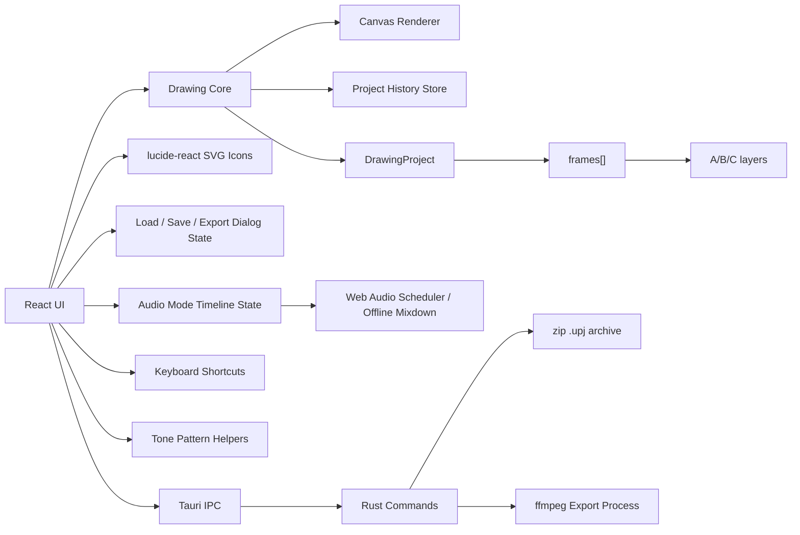

# Project Ugomemo Design

## 目次

- [目的](#目的)
- [スコープ](#スコープ)
- [アーキテクチャ](#アーキテクチャ)
- [プロジェクトモデル](#プロジェクトモデル)
- [描画ツール](#描画ツール)
- [履歴](#履歴)
- [キーボード](#キーボード)
- [モード](#モード)
- [再生速度](#再生速度)
- [オニオンスキン](#オニオンスキン)
- [レンダラー](#レンダラー)
- [ファイル操作](#ファイル操作)
- [Assets と PNG 素材](#assets-と-png-素材)
- [書き出し](#書き出し)
- [ステータス](#ステータス)
- [UI方針](#ui方針)
- [GitHub Pagesサイト](#github-pagesサイト)
- [拡張ポイント](#拡張ポイント)

## 目的

「うごくメモ帳」風の描き味を持つピクセル描画アプリを、ページ単位のフレームアニメーション制作ツールへ拡張する。

現在の主目的は、以下の状態境界を固めることです。

- 描画
- ページ配列
- レイヤー
- オニオンスキン
- 再生
- Audio Mode
- 保存/読込
- 音声つき書き出し

## スコープ

### 含める

#### キャンバスとプロジェクト

- 固定解像度のピクセルキャンバス
- 最大999ページのフレーム配列
- 初期ページ数は1
- `currentPageIndex`による現在ページ管理
- 各ページにA/B/Cの3レイヤー
- 各レイヤーに7段階のZ深さ
- 白・黒・赤・青・緑・黄の固定パレット
- 1レイヤーにつき使用できる描画色は2色
- プラットフォームごとの主修飾キー押下中だけ表示するオニオンスキン
- Undo / Redo

#### モードと描画

- Pen / Brush / Tone / Eraser / Shape
- Edit Modeでのページ編集
- Playback Modeでの再生プレビュー
- 固定/調整可能な`pixelsPerFrame`、横スクロール、timeline zoomによるAudio Mode編集
- 拡張可能な波形表示とclip内部編集UI

#### Audio Mode

- Web Audio APIによるAudio Mode再生エンジン
- 音声素材のパス管理
- Rust側metadata/waveform検査
- 録音保存
- 4トラックへのクリップ配置と編集
- `audioAssets`辞書
- `audioTracks`階層
- non-destructive clip schema
- offline media検出、赤表示
- Bundleによる`assets/`コピーと相対パス化
- 手動追加を含む`assets/`参照ルールとPNG素材要件
- クリップ単位のReverse / Trim / Split / Loop
- クリップ単位のvolume / panning / fadeIn / fadeOut

#### I/O と書き出し

- PNG/JPEG/WebP画像書き出し
- MP4/WebM/GIF/APNG動画書き出し
- Sprite Sheet書き出し
- MP4/WebMへのAudio Modeミックスダウン合成
- Video Only
- Audio Only (WAV)
- 書き出し進捗表示とキャンセル
- Load / Save / Export中のブロッキングオーバーレイ
- グローバルステータス表示
- Tauri IPC経由の`.upj`保存/読込パッケージ

### 含めない

- ブラシの物理シミュレーション

## アーキテクチャ



大きなReact UIは段階的に分割します。現時点で分割済みの責務は次の通りです。

- `src/ui/constants.ts`: 安定したUI定数
- `src/ui/types.ts`: 共有UI型
- `src/ui/components/IconButton.tsx`: 小さなpresentational component
- `src/ui/components/ProjectPreviewFrame.tsx`: プロジェクト解像度プレビューのcontain-style fit
- `src/ui/keyboard/shortcuts.ts`: キーボード処理
- `src/ui/tone/tonePattern.ts`: Tone pattern helper

Audio、Export、Timeline、Tauri副作用まわりのstate ownershipは、安全性を優先して引き続き主に`App.tsx`に置きます。

## プロジェクトモデル

`DrawingProject`はキャンバスサイズ、root `fps`、固定パレット、背景色、`frames`、`currentPageIndex`、`activeLayerId`、フィット表示用カメラを持ちます。

`fps`は`.upj`に保存され、Playback / Audio / Exportの標準同期クロックになります。

各`Frame`は`layers`を持ちます。各`Layer`は`ImageData`、2色の使用可能色、Z深さ、表示状態を保持します。

```ts
type DrawingProject = {
  width: number;
  height: number;
  fps: number;
  palette: PaletteColor[];
  backgroundColorId: string;
  frames: Frame[];
  currentPageIndex: number;
  activeLayerId: string;
  camera: Camera;
};
```

Audio Mode stateは`DrawingProject`とは別のReact stateとして保持し、保存時に`.upj`の`ProjectPayload`へ同梱します。

```ts
type AudioWorkstationState = {
  audioMaterials: AudioFilePath[];
  recordings: RecordedAudio[];
  timelineClips: TimelineClip[];
  audioAssets: Record<string, AudioAsset>;
  audioTracks: AudioTrack[];
};

type AudioAsset = {
  id: string;
  name: string;
  originalPath: string;
  durationMs: number;
  waveformSummary: number[];
  isOffline?: boolean;
};

type AudioTrack = {
  id: string;
  name: string;
  volume: number;
  isMuted: boolean;
  isSolo: boolean;
  clips: AudioClip[];
};

type TimelineClip = {
  id: string;
  sourceId: string;
  sourceType: "material" | "recording";
  trackIndex: number;
  startFrame: number;
  durationFrames: number;
  sourceOffsetFrames: number;
  loopCount: number;
  reversed: boolean;
  volume: number;
  panning: number;
  fadeInFrames: number;
  fadeOutFrames: number;
};
```

### プレビューの座標系

- Draw ModeのメインキャンバスとAudio Modeのフレームプレビューは、常に`project.width / project.height`を表示縦横比のsource of truthにします。
- 内部キャンバス解像度は変更しません。
- `ProjectPreviewFrame`が利用可能なUI領域を計測してobject-fit: contain相当の最大サイズを計算します。
- X/Yを別々に伸縮してはなりません。
- 余白は許容しますが、クロップはしません。
- ピクセルプレビューは`image-rendering: pixelated`を維持します。
- Draw Modeのポインタ座標は表示後のcanvas bounding rectからプロジェクト座標へ変換します。

## 描画ツール

Canvas Workstationの描画ツールはStrategy Patternで実装します。

各ツールは共通の`DrawingTool`インターフェースを実装し、以下を担当します。

- `beginStroke`
- `updateStroke`
- `finalizeStroke`
- `drawPreview`

通常のドラッグ描画は、UIが選択中の戦略を呼び出すだけにします。ツール固有の描画ロジックはstrategy側に閉じ込めます。

設定パネルはアクティブなツールに関連する項目だけを表示します。Shapeの形状/Fill設定やToneのモード設定は、他ツール選択時に隠します。

### ツール一覧

- Pen: 標準の線描画。Stroke Weightとround / squareのストローク形状を切り替えます。Penのstroke shapeは`ctx.lineCap` / `ctx.lineJoin`に任せず、明示的なstamp maskを使います。
- Brush: 表現向けのstamp-based tool。Spacingはブラシサイズ比率のスタンプ間隔、Scatterはブラシサイズ比率のdeterministic random offsetとして扱います。Brush専用の`BrushTip`と、Brush専用のrotation / rotation jitter / scale jitter / smoothing表現設定を持ちます。opacity、flow、pressureは意図的に未対応です。
- Tone: Pen Modeではshape maskとtone patternを掛け合わせるパターン付きストローク、Bucket Fill Modeではペイントバケツ型の塗りつぶしを行います。`ctx.getImageData()`を使うカスタムFlood Fillと、dot / line / noiseの3基本パターン、Fine / Normal / Coarseの3変種を組み合わせ、合計9種類をUIで選択できます。
- Eraser: `ctx.globalCompositeOperation = 'destination-out'`を使い、pointerMoveのたびにリアルタイムで既存ピクセルを透明化します。
- Shape: Line / Ellipse / Triangle / Rectangleを描画します。pointerDownで`getImageData()`によりキャンバススナップショットを保存し、pointerMoveで背景を復元してから新しいジオメトリを描きます。Lineは1回のドラッグで確定し、Triangle / Ellipse / Rectangleは2段階で確定します。

### Pen と Stamp

Pen strokeは4つの概念に分けます。

- Stroke path: pointerDown / pointerMoveから得たプロジェクト座標列です。画面ズームやCSSスケールから独立しています。
- Stamp placement: 隣接pointer間を決定的に補間し、Stroke Weightに対して十分短い間隔でstamp位置を置きます。
- Stroke shape mask: `src/drawing/strokeShapes/`のregistryにあります。round / squareそれぞれが`StampMask`のalpha配列を返します。
- Stamp renderer: mask alphaと選択色を`source-over`でアクティブレイヤーの`ImageData`に書き込みます。

アンチエイリアスはmask生成時に制御します。OFFは硬い二値alpha、ONはエッジに部分alphaを持ちます。新しい形状はshape定義ファイルを追加し、registryに登録するだけでPenに接続できます。

### Brush と Tone Pen

BrushとTone Pen Modeは`src/drawing/brush/`の共有infrastructureを使います。

- `settings.ts`: size / spacing / scatter / brush tip / antiAlias / rotationMode / rotationDegrees / rotationJitterDegrees / scaleJitter / smoothing / seedをまとめます。保存済み設定に新しいfieldがない場合は安全なdefaultへ戻します。
- `presets.ts`: BrushPresetの最小modelとbuilt-in presetsを持ちます。BrushPresetはBrushTipを参照するdrawing behaviorであり、BrushTipそのものではありません。
- `stampPlacement.ts`: pointer pathをspacingに従ってstamp列へ変換し、Brush Toolのstampごとのrotation / scale expressionを決定します。
- `seededRandom.ts`: Scatter、random rotation、rotation jitter、scale jitterをstampごとに決定するseeded PRNGです。undo/redoやドラッグ中の再描画で結果が安定します。
- `stampRenderer.ts`: stampごとの`StampMask`を`ImageData`に`source-over`合成します。選択中の描画色がRGBを決め、bitmap brush tipのPNG RGB channelは色に影響しません。
- `tips/types.ts`: Brush専用の`BrushTip`抽象です。round / squareのprocedural tipと、built-in bitmap tipを同じ`StampMask`解決結果として扱います。
- `tips/registry.ts`: built-in brush tip registryとapp-level custom brush tip definitionの登録口です。Penのstroke shape registryとは分離します。
- `tips/resolveBrushTipMask.ts`: `brushTipId`、maskSourceMode、size、effective smoothing、rotation bucket、scale bucketから描画用`StampMask`を解決します。bitmap tipの読み込みに失敗した場合はround tipへfallbackし、描画セッションを落としません。
- `tips/resizeStampMask.ts`: `StampMask`のリサイズを担当します。Brush sizeはbitmap tipの描画後max side lengthで、元PNGのaspect ratioを維持します。antiAlias OFFではnearest-neighbor、ONではalphaのsmooth samplingを使えます。
- `stamps/bitmap/loadBitmapStamp.ts`: PNG sourceをcanvas `ImageData`として読み込む最小loaderです。リサイズ、cache、fallback、registry lookupはここへ入れません。
- `stamps/bitmap/imageDataToStampMask.ts`: `ImageData`から`StampMask`へのmask conversionを担当します。PNG alphaだけでなく、bitmap Brush Tip preset用のRGB luminance modeを扱います。

BrushTipはPenの`penShape`とは別概念です。Penのround / square stroke shapeは`src/drawing/strokeShapes/`に残し、bitmap brush tipをPen stroke shapeとして登録しません。Brush Toolは`ToolSettings.brushTipId`を持ち、Brush Tool表示中だけTool SettingsにBrush Tip selectorを出します。selectorはregistryのhuman-readable labelを使い、round / square / built-in bitmap tipを選べます。Brush previewも選択中のBrushTip maskを使い、bitmap tipのpreview解決に失敗した場合もfallbackしてUIを止めません。

BrushPresetはBrushTipとは別のbehavior modelです。BrushTipはround、square、built-in bitmap、app-level imported bitmap、project-level bitmapのようなmask/sourceを表します。BrushPresetは`tipId`でBrushTipを参照し、size、spacing、scatter、rotation、jitter、scale jitter、smoothing、maskSourceModeなどの描画挙動をまとめます。BrushPresetにopacity、flow、pressure settingsは入りません。

Minimal BrushPreset shape:

```json
{
  "id": "preset:rough_chalk",
  "name": "Rough Chalk",
  "tipId": "tip:chalk",
  "size": 18,
  "spacing": 0.25,
  "scatter": 0.1,
  "rotationMode": "random",
  "rotationDegrees": 0,
  "rotationJitterDegrees": 30,
  "scaleJitter": 0.15,
  "smoothing": "smooth",
  "maskSourceMode": "alpha",
  "source": "custom"
}
```

Custom BrushPresetはapp data配下の`brush_tips/presets.json`へ保存します。UIはcurrent Brush settingsをcustom presetとして保存し、built-in/custom presetをselectできます。custom presetはrename/delete可能で、built-in presetはdestructive edit不可です。Presetの`tipId`がmissingの場合はwarning/statusを出し、round tipへfallbackしてアプリを落としません。Project-level preset modelはまだ分離しておらず、app-level custom presetsとbuilt-in presetsだけを扱います。

User-imported PNG Brush Tipsはapp-level user brush libraryとして管理します。Import UIはBrush Toolのsettingsに置き、Tauriのnative file dialogでPNGを選択します。選択ファイルはloadable imageとして検証し、元パスだけに依存せずapp data配下の`brush_tips/assets/`へコピーします。library metadataはapp data配下の`brush_tips/library.json`に保存します。duplicate importは現段階では常にnew assetとして保存し、unique idとunique filenameで衝突を避けます。

Imported Brush Tip metadataは、stable `id`、display `name`、`sourceType: "custom"`、app-managed `storedFilePath`、`importedAt`、optional `maskSourceMode`を持ちます。custom idは`custom:` prefixを使い、built-in idsと衝突させません。起動時にlibrary metadataを読み込み、custom tip definitionsをBrush registryへ登録します。既存tool settingsに保存されたcustom `brushTipId`は後方互換のため一旦保持し、library読み込み後に存在しないcustom idならroundへfallbackします。

Project-level Brush Tip assetsは`.upj`内のediting environment metadataです。描画結果そのものは従来通りlayer `ImageData`へbakedされ、brush assetsは別マシンで同じcustom Brush Tipを選んで編集を続けるために保存します。保存対象はprojectへattachedされたcustom Brush Tipだけで、app-level user brush library全体はembedしません。現在はcustom Brush Tipをimportまたはselectした時点でprojectの`brushAssets`へattachします。

`.upj` metadataには`brushAssets`を追加します。PNG bytesはZIP内の`assets/brushes/<id>.png`相当のpathへ保存し、metadataは次の形を基本にします。

```json
{
  "brushAssets": [
    {
      "id": "custom:example",
      "name": "Example",
      "path": "assets/brushes/custom_example.png",
      "kind": "bitmap",
      "source": "project",
      "maskSourceMode": "alpha",
      "smoothing": "inherit"
    }
  ]
}
```

`id`はproject内でstable、`name`はhuman-readable、`path`は`.upj`内PNG path、`kind`はbitmap tip、`source`はproject-level assetを示します。`maskSourceMode`はmissing時`alpha`、`smoothing`はmissing時`inherit`へdefaultingします。Runtime registryではsourceを`built-in` / `custom`(app-level) / `project`に分けます。Project assetはload時に`project:` prefix付きruntime idとして登録し、built-in idやapp-level custom idを上書きしません。再保存時はruntime prefixをmetadataから外し、project内idの安定性を保ちます。

Brush expression parametersはBrush Toolだけに適用します。`rotationMode`は`fixed` / `stroke-direction` / `random`です。`fixed`は`rotationDegrees`をbase angleにします。`stroke-direction`はpointer segmentからbase angleを取り、非常に短いsegmentでは前回角度または`rotationDegrees`へfallbackします。`random`はseeded randomでstampごとにbase angleを決め、同じstrokeの再描画で結果が変わらないようにします。`rotationDegrees`はfixedのbaseであり、stroke-direction / randomではoffsetとして加算します。`rotationJitterDegrees`はbase angleを中心にしたseeded random jitterです。`scaleJitter`は0.0-1.0のnormalized variationで、stamp sizeは安全な最小値へclampします。`smoothing`は`inherit` / `nearest` / `smooth`で、`inherit`は既存のglobal antiAlias設定に従います。

Bitmap Brush Tipの`maskSourceMode`は、PNG pixelから`StampMask.alpha`を作る方法です。defaultは`alpha`で、保存済みtipや古いbuilt-in definitionにfieldがない場合も既存と同じalpha-only挙動にします。invalid modeは`alpha`へfallbackします。対応modeは次の通りです。

- `alpha`: PNG alpha channelだけをmask alphaに使い、RGBは無視します。
- `luminance`: RGBをweighted luminanceへ変換し、その値をmask alphaにします。
- `inverted-luminance`: `255 - luminance`をmask alphaにし、暗いpixelほど強くします。
- `alpha-luminance`: PNG alphaとluminanceを乗算します。
- `alpha-inverted-luminance`: PNG alphaと`255 - luminance`を乗算します。

Luminance formulaは`luminance = 0.2126 * R + 0.7152 * G + 0.0722 * B`です。最終mask alphaは0..255へclampします。選択中の描画色がrendered colorを決めるため、luminance系modeでもPNG RGBはmask strengthにだけ影響し、描画色そのものには影響しません。

BrushTip cacheは2層です。original bitmap `StampMask`は`brushTipId`と`maskSourceMode`単位で保持し、PNGの再読み込みと再変換を避けます。transformed `StampMask`は`brushTipId`、`maskSourceMode`、size、effective smoothing mode、rotation bucket、scale bucketを含むkeyで保持し、同じ描画条件の再リサイズ・再回転を避けます。現在のrotation bucketは10 degrees、scale bucketは0.01です。procedural round / squareはこれまで通り同期生成でき、bitmap tipはresolver経由で既存stamp rendererへ渡せる`StampMask`になります。

Stamp renderingはpartial `ImageData` updateを使います。stamp batchごとに実際のtransformed `StampMask` dimensionsからdirty rectangleを計算し、canvas boundsへclipしてから`getImageData(x, y, width, height)`します。各stampはdirty rectangle local coordinatesへ変換して描画し、tone pattern samplerにはproject coordinatesを渡します。`putImageData`も同じdirty rectangleだけを更新します。scatter、rotation、scale jitterのpaddingは解決済みmask dimensionsに含まれるため、full-canvas renderingと同じ結果を保ちながら更新範囲を縮小します。

`brushTipId`、`rotationMode`、`rotationDegrees`、`rotationJitterDegrees`、`scaleJitter`、`smoothing`は`project-ugomemo.tool-settings.v1`のlocalStorage tool settingsに保存します。保存済みtool settingsにこれらがない場合はround、fixed、0、0、0、inheritへdefaultingし、既存設定を壊しません。既存`.upj`に`brushAssets` metadataがない場合はempty listとして読み込み、古いprojectのlayer dataはそのまま維持します。

Imported or project assetがmissingまたはloadできない場合、bitmap resolverはwarningを出し、round tipへfallbackしてdrawing sessionを継続します。Project load時に`.upj`内のbrush PNGがmissingでもmetadataは可能な範囲でprojectに残し、user actionなしに破壊的削除はしません。Full brush preset editor、complete brush library import/exportはfuture workです。Brush opacity、Brush flow、pressure response、pressure-based size / opacity / flowは意図的にunsupportedです。

Tone Pen Modeの品質改善は`finalAlpha = shapeAlpha × patternAlpha`を基本にします。

- `shapeAlpha`: round / squareのstamp maskから来ます。bitmap brush tipはBrush専用で、Tone Pen ModeのUIには接続しません。
- `patternAlpha`: プロジェクト座標に固定されたdot / line / noise samplerから来ます。
- patternはcanvas transformやstroke path stateに依存しません。
- 同じproject pixelは常に同じtone pattern位置を参照します。
- 将来のbitmap tone patternは、tileable PNGをproject coordinateでサンプリングするsourceとして追加します。

### Shape

- Triangleは最初のpointerDown座標を頂点、1段階目のドラッグ終端を底辺中心として扱い、2段階目のクリック位置から底辺幅を求めます。これにより、ドラッグ方向へ三角形が回転します。
- Ellipseは最初のpointerDown座標を中心、1段階目のドラッグ終端を長軸または単軸方向として扱い、2段階目のクリック位置から残りの軸幅を求めます。
- Rectangleは最初のpointerDown座標と1段階目のドラッグ終端を向きの中心線として扱い、2段階目のクリック位置から幅を求めます。
- 2段階目の待機中はTool Settingsにフィードバック表示を出し、キャンバス外クリックまたはEscapeでpending previewを破棄してキャンセルします。

Shapeのmodifierは描画中のkey stateを毎回反映します。

- Option / Alt押下中はLineを15度刻みにスナップします。
- Triangleは1段階目の回転方向を15度刻みにスナップし、形状を正三角形へ制約します。
- Rectangleも1段階目の回転方向を15度刻みにスナップし、形状を正方形へ制約します。
- Ellipseは正円へ制約します。
- Option / Altを離すと通常のジオメトリに戻ります。
- Line以外のShapeはFillボタンを持ちます。
- Shift押下中はFillボタンの設定値に関わらず一時的にfillを有効にし、Shiftを離すとFillボタンの永続設定に戻ります。

### Tone

ToneのBucket Fill ModeはFlood Fillの結果に対して1-2ピクセルのArea Expansionを行い、アンチエイリアス境界の白い隙間を抑えます。

その後、オフスクリーンキャンバスで生成したパターンを`createPattern()`で繰り返し描画し、マスク済みのトーンキャンバスを`destination-over`で既存の線画の背面へ合成します。これにより黒い線や境界のアンチエイリアスを壊しません。

パターンの密度と見た目は`toneDensity`と9種類の`tonePattern`で変化します。ToneのPen Modeは共有stamp rendererでshape maskとproject-anchored pattern samplerを掛け合わせます。

Tone UIは`src/ui/tone/tonePattern.ts`の`parseTonePattern()` / `buildTonePattern()`を使います。

- PatternとScaleを別コントロールとして表示します。
- ScaleはFine = `small`、Normal = `medium`、Coarse = `large`に対応します。
- UIは分離されていますが、内部値と保存値は既存の`dot-medium`のような`tonePattern`文字列のまま維持します。
- 保存済みプロジェクトとの後方互換性を壊しません。

### Tool Settings

- 設定パネルには小さなPreview Canvasを置きます。
- 各`DrawingTool`の`drawPreview`が現在の設定値でサンプルストロークやサンプル図形を描画します。
- Stroke Weight、shapeType、penShape、brushTipId、tonePattern、Brush Spacing、Brush Scatter、Shape Fillの変更が即座に視覚化されます。
- Tool Settingsはツールごとに保持します。
- Pen / Brush / Tone / Eraser / Shapeを切り替えても各ツールの前回値を復元します。
- カラーだけは現在の選択色として全ツールへ同期します。
- 描画UI上の線幅表記は`Size`ではなく`Stroke Weight`に統一します。
- Tool Settingsは`project-ugomemo.tool-settings.v1`としてlocalStorageに保存します。
- 保存するのはsize、toneDensity、penShape、brushTipId、brushSpacing、brushScatter、shapeType、toneMode、tonePattern、shapeFill、antialiasなどの操作設定です。
- colorは保存しません。colorは現在のアクティブレイヤーの色スロットから毎回同期し、プロジェクトのpalette / layer color ownershipと衝突させません。

## 履歴

- Undo / Redoは最大20スナップショットです。
- 履歴は`frames[]`全体、`currentPageIndex`、`activeLayerId`を保存します。
- 描画、レイヤークリア、ページClear / Paste / Duplicate / Insert New / Deleteなどのフレーム編集操作をUndo / Redoできます。
- 色変更時は現在ページの対象レイヤーに対して既存ピクセルを再マップします。
- 色変更時は履歴内の該当ページ・該当レイヤーにも同じ再マップを適用します。

## キーボード

### 基本方針

- ショートカット処理は`src/ui/keyboard/shortcuts.ts`に集約します。
- プラットフォーム判定、主修飾キー判定、表示ラベル生成はこのモジュールで行います。
- UIコンポーネント内に`navigator.platform` / `navigator.userAgent`などの判定を散らしません。
- macOSの主修飾キーはCommandです。
- Windows / Linuxの主修飾キーはCtrlです。
- Windows keyはWindows / Linuxではアプリの主修飾キーとして扱いません。
- ショートカットは`input` / `textarea` / `select` / `contenteditable`内で入力中は無視します。

### 操作一覧

- Save / Save As: Primary + S / Primary + Shift + S。macOSではCommand、Windows / LinuxではCtrlを使い、ブラウザやWebViewの標準保存動作は抑止します。
- Mode切り替え: プラットフォームPrimaryではなく物理Controlを使います。`Control+1`はDraw Mode、`Control+2`はEdit Mode、`Control+3`はPlayback Mode、`Control+4`はAudio Modeです。
- Draw ModeのTool切り替え: `Q` = Pen、`W` = Brush、`E` = Tone、`R` = Eraser、`T` = Shape。これらはDraw Modeに限定し、Edit / Playback / Audio ModeではTool変更しません。
- Brush size: `]`で縮小、`[`で拡大します。一般的なエディタと逆の割り当てですが、仕様としてこの対応を維持します。サイズは既存の最小/最大範囲に収めます。
- `Up`: アクティブレイヤーを上へ移動
- `Down`: アクティブレイヤーを下へ移動
- `Left`: 前ページへ移動
- `Right`: 次ページへ移動
- 先頭ページで`Left`: 1回目は「Create New Page?」を表示
- 確認表示中に`Left`: 先頭に新規ページを追加して移動
- 最終ページで`Right`: 1回目は「Create New Page?」を表示
- 確認表示中に`Right`: 新規ページを作成して移動
- 確認表示中に他のキー、描画、クリックなど別操作: 確認をキャンセル
- 連続作成状態では、別操作が入るまで最終ページの`Right`で即座に次ページを作成
- Playback Mode / Audio Mode中の`Left` / `Right`: 再生プレビューのスクラブ
- `Space`: Play / Stop切り替え
- `Option + Space` / `Alt + Space`: 選択中フレームから再生開始
- Draw/Edit Mode中の`Command+C` (macOS) / `Ctrl+C` (Windows / Linux): 現在フレームコピー
- Draw/Edit Mode中の`Command+V` (macOS) / `Ctrl+V` (Windows / Linux): 現在フレームへペースト
- Edit Mode中の`Delete` / `Backspace`: 現在フレーム削除
- Audio Mode中の`Delete` / `Backspace`: 選択クリップ削除
- Audio Mode中の`Command+C` (macOS) / `Ctrl+C` (Windows / Linux): 選択クリップコピー
- Audio Mode中の`Command+V` (macOS) / `Ctrl+V` (Windows / Linux): 再生ヘッド位置へクリップペースト

## モード

### Draw Mode

- 左列に描画ツールを表示します。
- 中央に描画キャンバスを表示します。
- 右列にレイヤー・背景・Z深さ・レイヤーClearを表示します。
- プラットフォームごとの主修飾キー押下中だけ、前後ページの同じレイヤーを薄く表示します。

### Edit Mode

- 中央にページ列を表示します。
- 選択ページに対してClear / Copy / Paste / Duplicate / Insert New / Deleteを実行できます。
- ページ列は横スクロールで表示します。
- 各ページは実フレームを描画したサムネイルで表示します。
- 現在ページはdeep pinkの選択色、影、拡大で強調します。
- クリックや`Left` / `Right`移動に合わせて自動スクロールします。
- Copy以外の操作は履歴へ記録します。

### Playback Mode

- 中央に大きなプレビューキャンバスを表示します。
- 下部にページ列を表示します。
- Play / Pauseトグル、Stop、開始位置リセット、速度選択を表示します。
- 再生は現在選択中のプレビュー位置から始まります。
- 最後のページ後は先頭へループします。
- `Left` / `Right`はプレビュー位置のスクラブに使います。
- ページ列はアクティブフレームを自動スクロールで表示範囲内に保ちます。
- Audio Modeのタイムラインクリップも同じ再生時計に同期して鳴ります。

### Audio Mode

#### レイアウト

- 2カラムに分割します。
- 左はMaterial Libraryです。
- 中央は小型フレームプレビューとWorkstation / Mixerタブを表示します。
- Material LibraryヘッダーにはAdd / Bundle / Recordを同じ操作群として配置します。
- Recordingは固定右列ではなくRecordボタンから開くmodalとして扱います。

#### 時間軸

- Audio Modeの時間軸はproject root `fps`から計算します。
- Drawing/Edit modeの`project.frames.length`はアニメーション本体の基準尺として残します。
- Audio Modeの編集キャンバスは`project.frames.length`に完全固定されません。
- 音声clipはproject frame範囲を越えて配置、trim、loopできます。
- 横スクロールとzoomにより余白を含む編集領域を扱います。
- `currentTime = activeFrame / fps`、`totalTime = frameCount / fps`として、ルーラー、再生ヘッド、Play/Pause/Stopの同期に使います。
- Play/Pauseは同じボタン位置で切り替えます。
- Stopは再生中なら現在フレームで停止します。
- 停止状態でもう一度Stopを押すと先頭フレームへ戻ります。

#### 素材と録音

- 左カラムは`.mp3` / `.wav` / `.m4a`素材をOSダイアログから追加します。
- Rust側でdurationとwaveform summaryを取得して`audioAssets`へ登録します。
- 音声読み込みはTauri asset protocolを有効化します。
- frontendではasset URLへ変換して取得します。
- Load時は相対パスを`.upj`基準に解決します。
- 存在しない素材はofflineとして赤表示します。
- Bundleは参照素材をプロジェクト横の`assets/`にコピーし、asset pathを相対パスへ書き換えます。
- 録音ファイルはプロジェクト配下の`record/`に保存し、Asset Listにも自動追加します。
- 録音UIはmodal内にあります。
- 録音UIはマイク入力セレクタ、Record/Stop、既存録音のPlay/Stop/Rename/Deleteを持ちます。

#### Workstation View

- 素材または録音のドラッグ&ドロップを受け付けます。
- ドラッグ中は対象トラックと配置フレームをゴーストクリップで表示します。
- HTML5 D&Dの`dragover`では`dataTransfer.getData()`が空になるため、drag sourceはReact refに保持します。
- dragoverのghost previewとdrop calculationはそのrefを読みます。
- `pixelsPerFrame`は固定/調整可能なzoom値としてAudio toolbarに持ちます。
- timelineは`pixelsPerFrame`に基づく横長コンテンツを描画して水平スクロールします。
- timeline content幅は`max(project.frames.length, clip end, editing padding)`から決まります。
- timeline全体を1画面に押し込めません。
- clip描画、playhead、ruler、drop位置、edge draggingはすべて同じ`pixelsPerFrame`を使います。
- rulerはAudio toolbarのunit selectorでFrames表示とTime表示を切り替えます。
- Framesではframe index、Timeでは`frameIndex / fps`の秒数を表示します。
- Grid ON/OFFはruler tickと同じ位置に縦グリッド線を表示/非表示します。
- ghost previewの幅は素材durationをframe換算した値を使い、project末尾で切らずに実尺を表示します。
- drop時もstartFrameとdurationFramesを同じ計算で決めます。
- track headerはトラック名のみを表示し、double-clickでrenameします。
- Canvas APIでwaveform summaryをクリップ背景に描画します。
- 右クリックメニューでDelete / Duplicate / Copy / Paste / Split / Reverseを実行します。
- クリップ右上エッジのドラッグはLoopに割り当てます。
- クリップ右下エッジのドラッグはTrimに割り当てます。
- project frame countに縛られず柔軟に伸縮できます。

#### Mixer View

- 全trackのlong-throw volume faderを表示します。
- 同期するnumber inputを表示します。
- peak meter、Mute、Soloを表示します。
- Master meterを右端に置きます。
- Mixerの変更は`audioTracks`へ直接反映され、Web AudioのTrack Gainに反映されます。

#### Web Audio Engine

- singleton `AudioContext`で素材をdecodeしてキャッシュします。
- 再生開始フレームからクリップ開始時刻を逆算して`AudioBufferSourceNode`をスケジュールします。
- SourceNodeはseek/playごとに再生成します。
- seek/scrubでは既存nodeをstop/disconnectして再スケジュールします。
- Reverseは反転済み`AudioBuffer`を生成します。
- Trim/Splitは`sourceOffsetFrames`と`durationFrames`で再生範囲を制御します。
- Loopは`loopStart` / `loopEnd`と`loopCount`相当の再生時間で処理します。
- Clip Gain、StereoPanner、Track Gainによりclip volume、track volume/mute/solo、panning、fadeInFrames、fadeOutFramesを反映します。
- 動画書き出し時は`OfflineAudioContext`で同じタイムラインをレンダリングし、WAVへエンコードしてRust側のffmpeg入力へ渡します。

## 再生速度

| Speed | FPS | sec/page |
| --- | ---: | ---: |
| 0 | 0.2 | 5.000 |
| 1 | 0.5 | 2.000 |
| 2 | 1 | 1.000 |
| 3 | 2 | 0.500 |
| 4 | 4 | 0.250 |
| 5 | 6 | 0.166 |
| 6 | 8 | 0.125 |
| 7 | 12 | 0.083 |
| 8 | 20 | 0.050 |
| 9 | 24 | 0.042 |
| 10 | 30 | 0.033 |

## オニオンスキン

- オニオンスキンは前後ページ全体ではなく、現在の`activeLayerId`と同じレイヤーだけを描画します。
- 前ページはやや濃く、次ページはより薄く表示します。
- 通常時は表示しません。
- macOSではCommand、Windows / LinuxではCtrl押下中だけ有効にします。

## レンダラー

- 初期実装は`CanvasRenderer`です。
- `imageSmoothingEnabled = false`を徹底します。
- 描画ウィンドウ内に最近傍でフィット表示します。
- 描画モードでは現在ページを描画します。
- Playback Mode / Audio Modeでは`playbackIndex`のページを描画します。
- すべてのプレビューキャンバスは4:3の`aspect-ratio`フレーム内に収めます。
- 伸縮で歪ませません。
- Audio Modeの小型プレビューは利用可能な高さにフィットさせ、幅は4:3比率から決めます。

## ファイル操作

### Save / Load

- Saveは現在追跡している`.upj`パスへ直接上書きします。
- Save AsはTauri v2のネイティブSave Dialogから開始し、ユーザーのDocuments配下にプロジェクトパッケージを作ります。
- Save / Save Asショートカットは`src/ui/keyboard/shortcuts.ts`のplatform-aware labelと検出ヘルパーを使います。
- LoadはTauri v2のネイティブOpen Dialogで`.upj`を選びます。
- Rust側でzipを開いて`metadata.json`を読み、各レイヤーPNGをRGBAにデコードし、Audio Mode stateと一緒にReactへ返します。
- Dirty状態は上部バーの`Save *`とOSウィンドウタイトル末尾の`*`で表示します。
- Load / Save / Export中はブロッキングオーバーレイを表示し、アプリ全体への入力を遮断します。

OSウィンドウタイトルは以下の形式に同期します。

```text
Project Ugomemo - sample_project.upj
Project Ugomemo - sample_project.upj *
```

### プロジェクトディレクトリ

```text
Documents/Project Ugomemo/sample_project/
├── sample_project.upj
├── assets/
├── image/
├── movie/
└── record/
```

### `.upj`

`.upj`はzipベースで、全ページの全レイヤーPNG、プロジェクトメタデータ、Audio Mode stateを格納します。

```text
sample_project.upj
├── metadata.json
└── frames/
    └── page-1/
        └── layers/
            ├── a.png
            ├── b.png
            └── c.png
```

`metadata.json`には以下のAudio Mode配列も含まれます。

- `audioMaterials`
- `recordings`
- `timelineClips`

古い`.upj`にこれらのキーがない場合は空配列として読み込みます。

SnapはAudio Mode編集時の配置補助であり、保存条件ではありません。

- `timelineClips`と`audioTracks.clips`の`startFrame` / `durationFrames` / `sourceOffsetFrames` / fade frame値は小数フレームを保持できる数値としてRust側でも受け取ります。
- off-snapの音声素材やクリップを強制スナップ、削除、丸め保存しません。
- NaNやInfinityのような非有限値だけは保存前に安全な数値へ正規化します。

## Assets と PNG 素材

### Assets

- `assets/`はプロジェクトに同梱する外部素材の置き場です。
- Bundle実行時に音声素材を`assets/`へコピーします。
- Bundle実行時にmetadata内の参照をプロジェクト相対パスへ正規化します。
- 通常の素材追加はUIを入口にします。
- Audio ModeのMaterial LibraryでAddを押し、`.mp3` / `.wav` / `.m4a`をOSダイアログから選択します。
- Rust側でdurationとwaveform summaryを検査して`audioAssets`へ登録します。
- 保存済みプロジェクトでBundleを実行すると、参照中の外部音声をプロジェクトディレクトリ直下の`assets/`へコピーします。
- `audioAssets[*].originalPath`を`assets/<file>`形式の相対パスへ書き換えます。
- Load時は`.upj`のあるディレクトリを基準に相対パスを解決します。
- 見つからない素材はofflineとして扱います。

### 手動追加

- 手動で素材を追加する場合も、配置先はプロジェクト直下の`assets/`に限定します。
- metadataに手で参照を足す場合は絶対パスではなく`assets/file-name.ext`のようなプロジェクト相対パスを使います。
- `assets/`はユーザー管理の外部素材です。
- `.upj`内の`frames/**/layers/*.png`はアプリ管理の永続レイヤーPNGとして扱います。

### PNG素材の受け入れ要件

- レイヤーPNGは`metadata.json`の`width` / `height`と同じ寸法でなければなりません。
- デコード結果はRGBA 8-bitを前提にします。
- 透明度はalpha channelで保持します。
- indexed color / palette PNG、APNG、色変換プロファイルに依存するPNGは避けます。
- ピクセルアート用途では固定パレットの白・黒・赤・青・緑・黄と透明を基本にします。
- 補間で発生した中間色を持ち込みません。
- 将来のbitmap brush tipやtone pattern PNGは、alpha maskまたはtile sourceとして読み込めるように、透明背景つきRGBA PNGを標準形式にします。
- `assets/`内のファイル名はASCII英数字、ハイフン、アンダースコアを推奨します。
- 重複名は上書き衝突として扱います。

## 書き出し

### 画像書き出し

- 画像書き出しはReact側で合成済みフレームをPNG/JPEG/WebPへ変換し、Rust側でファイルへ書き込みます。
- Image ExportはAll Frames / Select Partial Framesを持ち、PNG/JPEG/WebPで出力します。
- Transparent Backgroundが有効な場合、背景色塗りを省略してalphaを保持します。

### 動画書き出し

- 動画書き出しはReact側で合成済みPNG列を作り、Rust側で一時フレームに展開します。
- Rust側で`ffmpeg`からMP4/WebM/GIF/APNGを生成します。
- MP4/WebMではReact側のOfflineAudioContextでミックスダウンしたWAVもffmpegへ渡します。
- Video ExportはMP4 / WebM / GIF / APNG / Sprite Sheet / Audio Only (WAV)を持ちます。
- MP4 / WebM / GIF / APNGはffmpegで生成します。
- Sprite SheetはReact側でグリッド状に合成したPNGをRust側で保存します。
- MP4 / WebMはAudio ModeのミックスダウンWAVを含められます。
- WebMはVP9 + `yuva420p`で透明背景向けにエンコードします。
- GIF/APNGは音声を含みません。
- Video Onlyは音声入力を省略します。
- Audio Only (WAV)は動画フレームを生成せずミックスWAVを書き出します。

### Export modal

- Export modalはTarget FPS、output width/height、audio sample rateを持ちます。
- Target FPSはproject `fps`を初期値にし、選択された値をffmpeg `-framerate`へ渡します。
- width/heightはReact側の合成フレームとRust側のffmpeg scale filterの両方に適用します。
- audio sample rateは`OfflineAudioContext`のsample rateとして使います。
- Video tabではpreview windowが選択FPSでフレームを回し、書き出し前に見た目とペーシングを確認できます。
- Export設定ダイアログはmodalとして背景UIへの入力を遮断します。
- Export中はさらにブロッキングオーバーレイを表示し、フェーズ名、percent、progress barを表示します。
- Rust側は`export-progress`イベントをemitし、frame staging / audio staging / ffmpeg encoding / completeの進捗をfrontendへ流します。
- CancelはReact側のフレームレンダリングを中断します。
- ffmpeg実行中であれば、CancelはRust側の`cancel_active_export`でプロセスを停止します。

## ステータス

- 動的ステータスはモード個別パネルではなく、上部アクションバー中央の`aria-live` readoutに表示します。
- Draw / Edit / Playback / Audioのどのモードでも、Load / Save / Export / Audio操作の結果が常に見えます。

## UI方針

### 色と全体

- アプリUI自体は白とピンクを基調にします。
- 選択状態はdeep pink `#ff1493`で統一します。
- 描画色として白・黒・赤・青・緑・黄を提供します。
- UI装飾は二色に絞ります。
- 罫線、影、面の強弱はピンクの線幅と白地の余白で表現します。

### アイコンとボタン

- 操作ボタンは`lucide-react`のSVGアイコンを標準にします。
- Draw/Edit/Playback/Audioのモード切替、ファイル操作、フレーム編集、Playback操作、Audio素材操作、MixerのMute/Solo、クリップコンテキストメニューなど、機能が直感的な記号で表せる箇所はテキストラベルよりアイコンを優先します。
- Draw Tool、Export tab、Export scope、Export actionsのように誤認を避けたい場所はアイコンと名前を併記します。
- フォーム項目、選択肢、ステータス、長い説明が必要な内容は可読性を優先してテキストを残します。
- アイコンボタンは共通の`IconButton`パターンで`aria-label`とnative `title`を必ず持ちます。
- hover時は既存のdeep pink反転に加えてアイコンを軽く持ち上げます。
- 視覚的な反応とブラウザ標準ツールチップの両方で操作内容を確認できるようにします。
- Draw Tool、Mode、Save / Save Asなど主要アクションは`src/ui/keyboard/shortcuts.ts`の集中管理されたショートカットラベルを使います。
- 例: `Pen (Q)`、`Draw mode (Ctrl+1)`、`Save (⌘S)`

### 個別UI

- Layer visibilityはcheckboxラベルではなくEye / EyeOffアイコンそのものをボタン化します。
- Layer clearは消去を示す点線系アイコンと点線ボーダーで通常のDeleteと区別し、アイコンと名前を併記します。
- Edit Modeのコマ操作は誤操作を避けるため、Clear / Copy / Paste / Duplicate / Insert New / Deleteをアイコンと名前の併記にします。
- Audio ModeのSnapはグリッドアイコンではなく`SNAP`表記を維持し、ON/OFFはactive stateで示します。
- Record modalはFormat、Mic、Count Down、Recordを各1行で表示します。
- Record行にはRecord/StopとPause/Resumeを横並びで置きます。
- 録音ボタンは赤系の強い色とRecording中の反転表示で状態を伝えます。
- Pause中は音声chunkの追加を止め、Resume後に同じtakeへ継続録音します。

## GitHub Pagesサイト

`docs/`配下のGitHub Pagesサイトは、アプリの詳細仕様書ではなく、初見ユーザーとポートフォリオ閲覧者に向けた入口として設計します。

### 役割

- Project Ugomemoが何をするデスクトップアニメーション制作ツールなのかをHeroで説明します。
- Current Statusで初期テスト版であること、最新リリース、試せる配布形式を示します。
- Releases、GitHub、READMEへの導線をHeroから見える位置に置きます。
- Conceptで、軽く直接的に短いフレームアニメーションを試作する制作体験を説明します。
- FeaturesはDraw / Playback / Audioの雰囲気を残しつつ、Drawing、Animation、Layers、Playback、Audio、File、Exportを一覧化します。
- Basic Workflowで、新規作成から描画、再生確認、音声配置、書き出しまでを短い手順で示します。
- Tech StackでTauri、React、TypeScript、Rust、Web Audio API、ffmpeg sidecar export flowを伝えます。
- 詳細仕様や開発者向け情報はREADMEへ誘導します。

### コンテンツ運用

- 日本語ページ`docs/ja/index.html`と英語ページ`docs/index.html`は、情報構成に大きな差が出ないよう同時に更新します。
- GitHub Releasesのタグ、対応OS、配布形式は、実際のReleaseページとassetを確認してから記載します。
- 存在しない直接ダウンロードリンクは作りません。試用導線はReleasesページへのリンクを基本にします。
- Samplesは実在する`docs/assets/`内の作例だけを参照します。
- 2026-06-16時点では、掲載中サンプルは`docs/assets/sample-animation.mp4`の1件です。
- 今後作例を追加する場合は、Samples sectionのカード構造へ実在する画像/動画/`.upj`だけを追加します。

### ビジュアル方針

- アプリ本体と同じ白いグリッド、ピンクの罫線、deep pinkの選択色、モノスペース文字を維持します。
- 新しい情報量を追加しても、カードの入れ子や過剰な装飾を避けます。
- モバイルではCTA、Features表、Samplesカードを1列に落とし、横スクロールを出さないことを優先します。
- 画像には内容が分かるaltを付け、動画だけで意味が伝わらない場合は周辺テキストで補足します。

## 拡張ポイント

- 波形表示とクリップ内部編集
- decode済みPCMからの高精度波形生成
- 音声クリップの埋め込み保存
- ffmpegバイナリ同梱またはパス設定UI
- レイヤーブレンドモード
- ブラシサイズ、パターン、ディザ
- PixiJS/WebGLレンダラー追加
